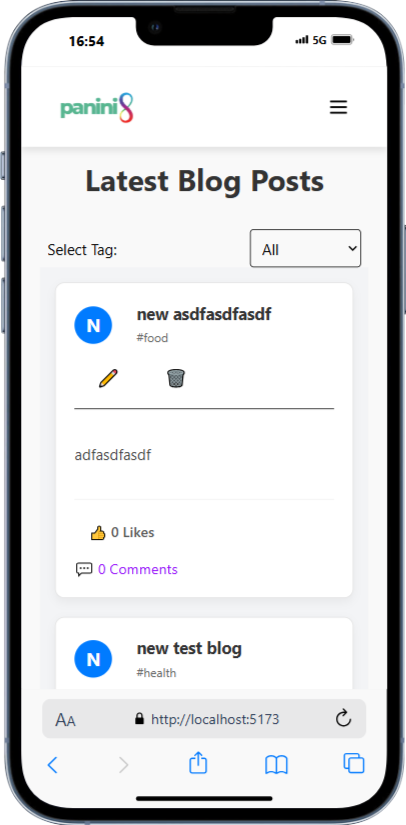
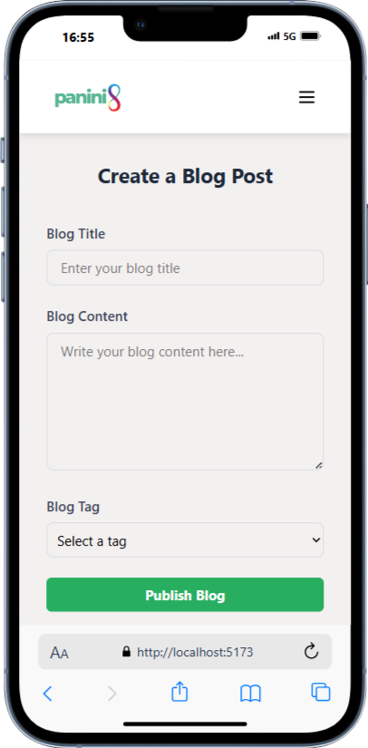
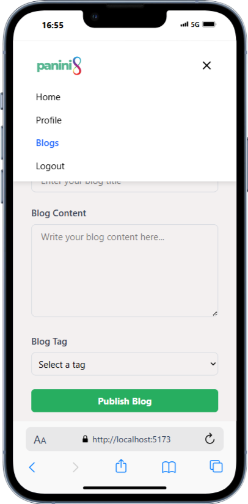
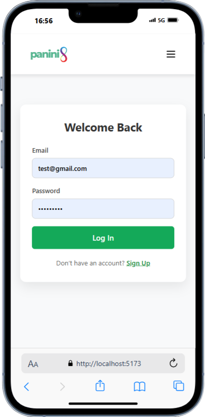

# BlogPost Application

A full-stack blogging platform where users can create, edit, delete, and comment on blog posts. The application features a responsive frontend built with React and a backend powered by Node.js and MongoDB.

---

## Features

- **User Authentication**: Secure login and registration using JWT.
- **Create, Edit, Delete Posts**: Users can manage their blog posts.
- **Comment on Posts**: Add comments to blog posts.
- **Like Posts**: Like functionality for blog posts.
- **Filter by Tags**: Filter blog posts by tags.
- **Responsive Design**: Fully responsive UI for mobile and desktop.

---

## Deployed Link :

        --Front-end : https://panani8-duna.vercel.app/
        --Backend : https://panani8.onrender.com

### Frontend:

- **React**: For building the user interface.
- **Tailwind CSS**: For styling and responsiveness.
- **React Router**: For navigation.
- **Axios**: For API requests.

### Backend:

- **Node.js**: For server-side logic.
- **Express.js**: For building RESTful APIs.
- **MongoDB**: For database storage.
- **Mongoose**: For MongoDB object modeling.
- **JWT**: For authentication.

---

## Installation

### Prerequisites:

- Node.js installed on your system.
- MongoDB installed and running.

## API Endpoints

Authentication:
POST /api/register: Register a new user.
POST /api/login: Login a user.
Posts:
POST /api/create/post: Create a new post.
GET /api/post/getAll: Get all posts.
PUT /api/post/:id: Update a post.
DELETE /api/post/:id: Delete a post.
Comments:
POST /api/post/:id/comment: Add a comment to a post.

## Screenshots

Here are some screenshots showcasing the BlogPost application:

  
_The homepage displaying a list of blog posts._

  
_Detailed view of a single blog post with comments._

  
_Interface for creating a new blog post._

  
_Login and registration page for user authentication._

### Steps:

1.  Clone the repository:
    ```bash
    git clone https://github.com/your-username/BlogPost.git
    cd BlogPost
    ```
2.  --cd Backend
    -- npm install
3.  cd ../frontend
    npm install
4.                  PORT=8080
        MONGO_URI=your-mongodb-connection-string
        JWT_SECRET=your-jwt-secret
        JWT_EXPIRATION=1h

        ## Folder Structure

        BlogPost/

    ├── Backend/
    │ ├── Controller/
    │ │ ├── Auth/
    │ │ │ └── auth.js
    │ │ ├── post/
    │ │ │ └── postcontroller.js
    │ ├── Middleware/
    │ │ └── authMiddleware.js
    │ ├── Model/
    │ │ ├── AuthModel.js
    │ │ └── PostModel.js
    │ ├── Routes/
    │ │ └── routes.js
    │ └── server.js
    ├── frontend/
    │ ├── src/
    │ │ ├── Components/
    │ │ │ ├── Blogs.jsx
    │ │ │ ├── Home.jsx
    │ │ │ └── [Navbar.jsx](http://_vscodecontentref_/0)
    │ │ ├── constants/
    │ │ │ └── api.js
    │ │ ├── styles/
    │ │ │ └── Navbar.css
    │ │ └── utils/
    │ │ └── config.js
    │ └── public/
    └── README.md
